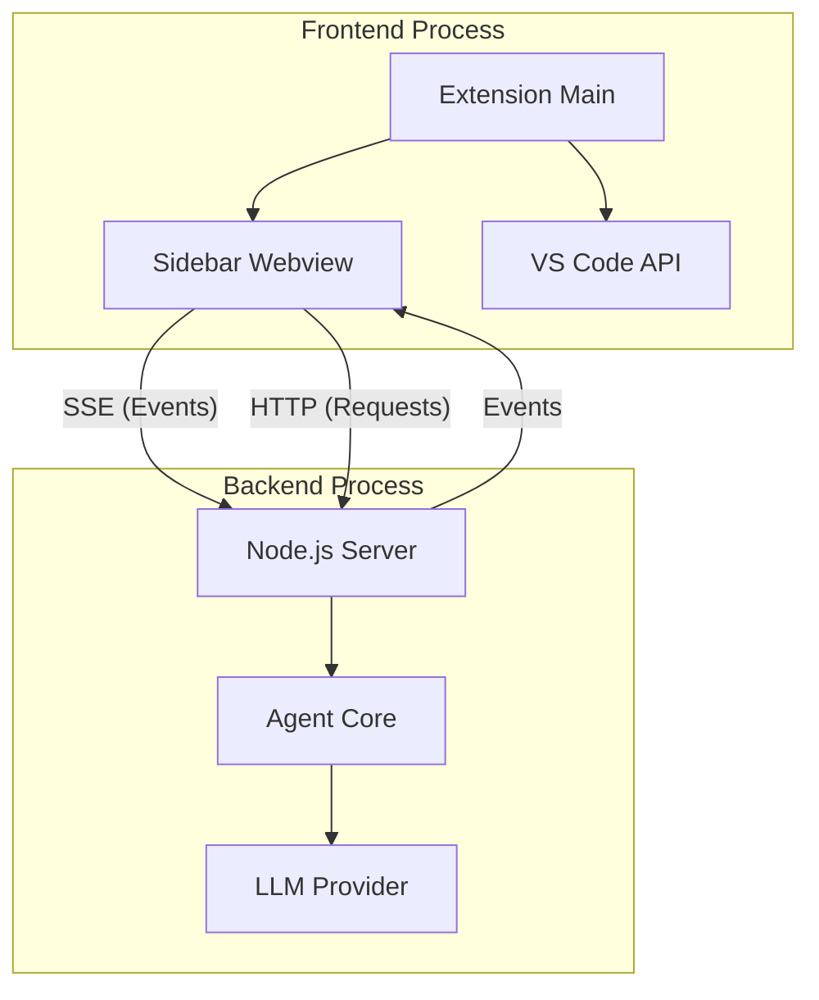

# VS Code Extension Architecture

Audience: VS Code extension contributors; read with `ARCHITECTURE_DIAGRAM.md` for core flow.  
Nav: [Docs index](README.md) · [Contributor Runbook](CONTRIBUTOR_RUNBOOK.md) · [Patterns](patterns/INDEX.md)

This document outlines the architecture of the Maestro VS Code extension, specifically focusing on its **Client-Server** design and the **Remote Tool Execution** pattern used to bridge the gap between the Agent (Backend) and the VS Code API (Frontend).

## 1. High-Level Overview

The VS Code extension operates using a split-process model to separate the AI logic from the UI and Editor integration.



### Components

1.  **Frontend (VS Code Extension):**
    *   **Role:** Thin client. Handles UI rendering, user input, and interactions with the VS Code API (e.g., reading files, diagnostics, definitions).
    *   **Entry Point:** `packages/vscode-extension/src/extension.ts`
    *   **Sidebar Logic:** `packages/vscode-extension/src/sidebar/composerSidebar.ts`

2.  **Backend (Web Server):**
    *   **Role:** The "Brain". Runs the AI Agent, manages context, handles LLM streaming, and tracks state.
    *   **Entry Point:** `src/web-server.ts`
    *   **Process:** Spawns as a child process of the Extension.

## 2. Remote Tool Execution Pattern

A key challenge is that the **Agent** runs in the Backend (Node.js process) but needs to execute tools that rely on the **VS Code API** (which is only accessible in the Frontend process).

To solve this, we use a **Remote Tool Execution** pattern:

1.  **Tool Definition:** Tools like `vscode_get_diagnostics` are defined in `src/tools/vscode.ts`.
    *   They are marked with `executionLocation: "client"`.
    *   The Backend *knows* about them but cannot *execute* them.

2.  **Execution Flow:**

    ```mermaid
    sequenceDiagram
        participant LLM
        participant Backend as Agent (Backend)
        participant Frontend as Extension (Frontend)
        participant VSCode as VS Code API

        LLM->>Backend: Call Tool "vscode_get_diagnostics"
        Backend->>Backend: Identify executionLocation="client"
        Backend->>Frontend: Send "client_tool_request" Event (via SSE)
        Frontend->>VSCode: Execute vscode.languages.getDiagnostics()
        VSCode-->>Frontend: Return Diagnostics
        Frontend->>Backend: POST /api/chat/client-tool-result
        Backend-->>LLM: Return Tool Result
    ```

3.  **Implementation Details:**
    *   **Backend:** `ClientToolService` (`src/server/client-tools-service.ts`) pauses the tool execution and waits for a resolution.
    *   **Frontend:** `composerSidebar.ts` listens for `client_tool_request`, executes the logic, and calls `submitClientToolResult`.

## 3. Context Isolation

To prevent the Agent from "hallucinating" VS Code capabilities when running in other environments (like the CLI TUI), we strictly isolate the toolsets.

*   **CLI / TUI (`src/main.ts`):**
    *   Loads standard `codingTools`.
    *   **Does NOT** load `vscodeTools`.
    *   The Agent is unaware of VS Code-specific capabilities.

*   **VS Code Server (`src/web-server.ts`):**
    *   Loads `[...codingTools, ...vscodeTools]`.
    *   Injects the `ClientToolService` into the transport layer.
    *   This is the only environment where `vscode_` tools are available.

## 4. Key Files

*   **`src/web-server.ts`:** Entry point for the backend server used by VS Code.
*   **`src/tools/vscode.ts`:** Definitions for VS Code-specific tools (marked `executionLocation: "client"`).
*   **`src/server/client-tools-service.ts`:** Backend service to manage pending client tool requests.
*   **`packages/vscode-extension/src/sidebar/composerSidebar.ts`:** Frontend logic handling events and tool execution.
